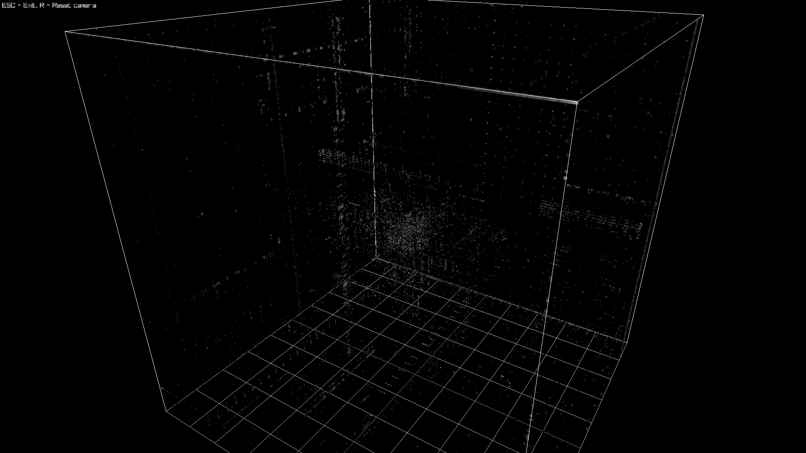
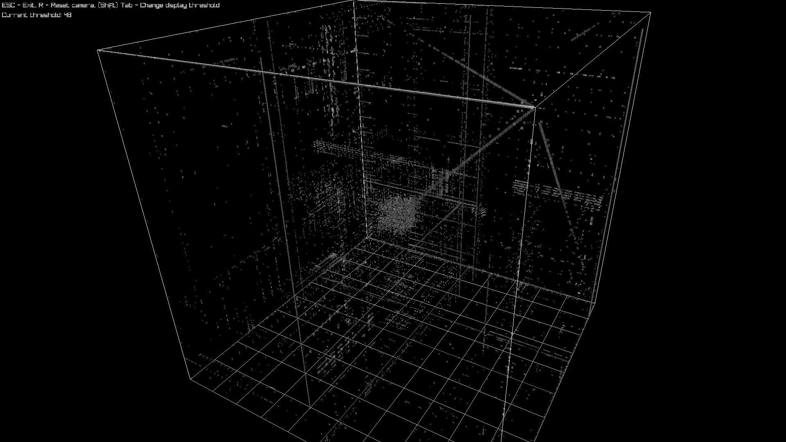
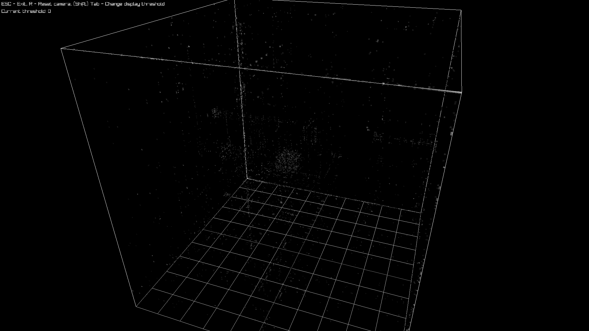
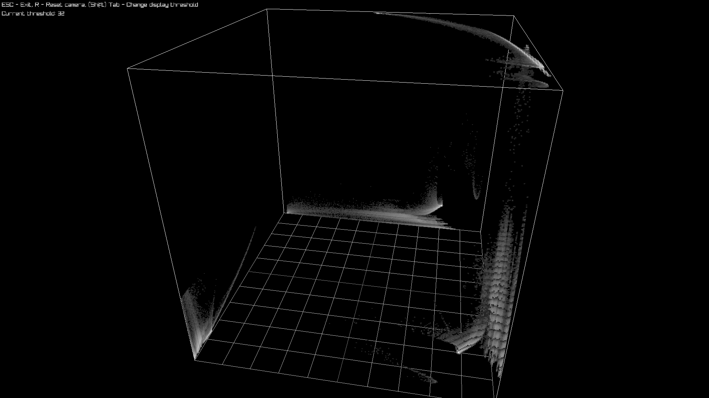
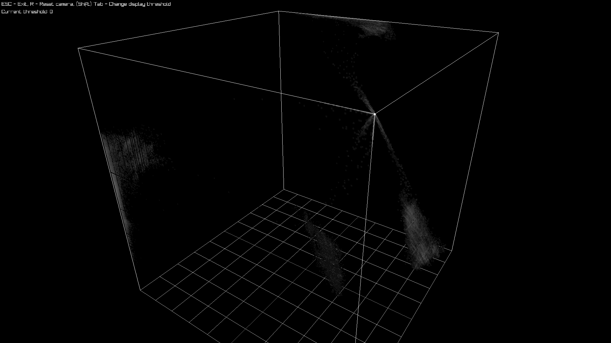
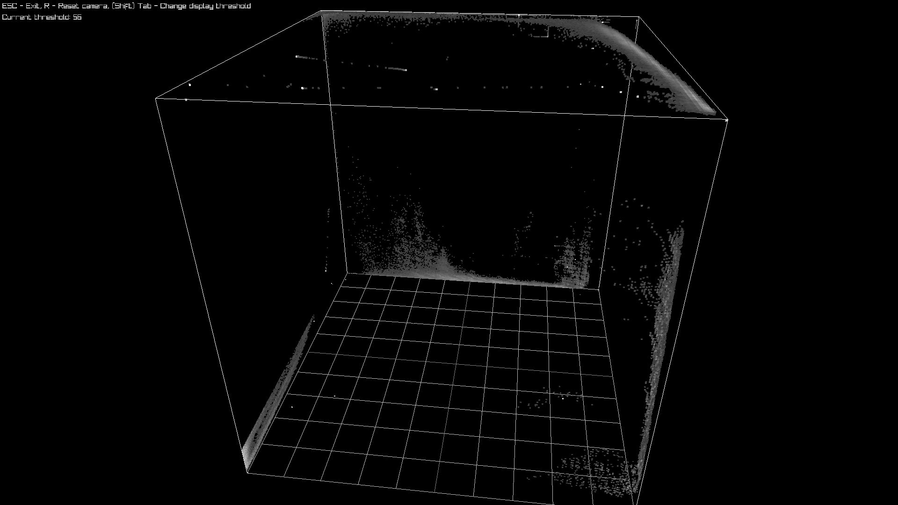
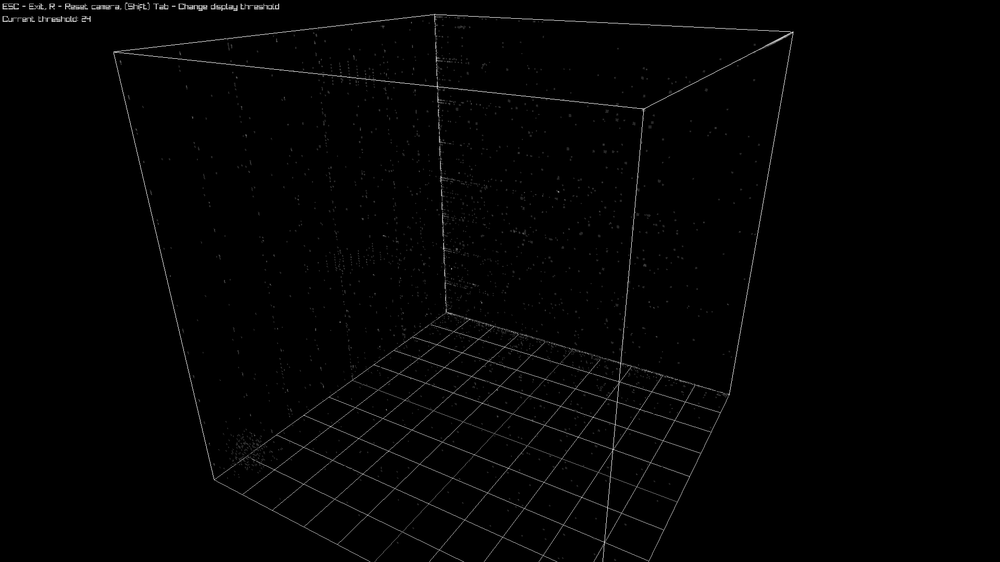
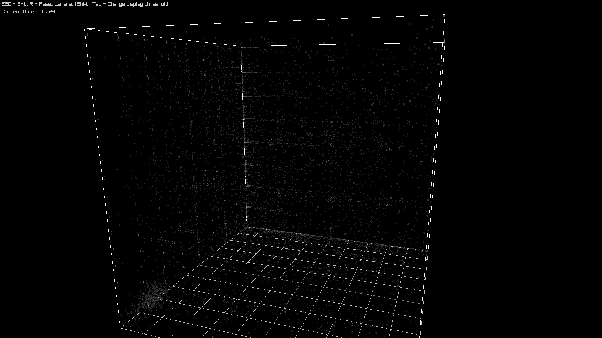

# Binary Visualization

This is a 3D version of a program made by tsoding: https://github.com/tsoding/binviz
Binary Visualization based on Christopher Domas talk: https://www.youtube.com/watch?v=4bM3Gut1hIk

## Main Idea

- Scan the triples of bytes of a file with a sliding window. (`AA BB CC DD ...` -> `(AA, BB, CC) (BB, CC, DD) ...`);
- Interpret the triples of bytes as coordinates on a 256x256x256 3D volume;
- Place a dot for each triple in the volume;
- The more frequent the dot, the brighter it is;
- Different patterns emerge depending on the type of the data of the file.

## Demo

### x86_64 ELF executables





### RGBA32 Raw Images





### Ogg Files




## Quick Start

```console
$ cc -o nob nob.c
$ ./nob binviz ./nob.c
$ ./3dviewer nob.c.binviz3d
```

## Limitations of the 3D viewer
The mesh might get so big it isn't displayed correctly.
In such case you can raise the threshold with the tab key to ignore more darker points.
